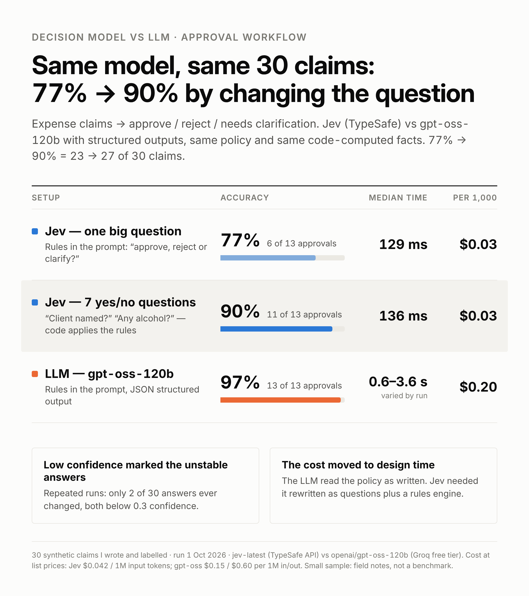

# Jev (System One decision model) vs an LLM on an approval workflow

A small, hands-on comparison of TypeSafe AI's **Jev** and an LLM with structured outputs on the same decision:
should an expense claim be **approved**, **rejected**, or does it **need clarification**?

Run on **1 October 2026**. Everything here (code, the 30 test claims, raw outputs and terminal logs) is included so you can check or rerun it.



> Small and synthetic: 30 claims I wrote and labelled myself, one task, one LLM. Read it as field notes, not a benchmark.

## In short

- **How I asked Jev mattered most.** Same model, same 30 claims: 23–24 correct as one big question, 27 as 7 yes/no questions with code applying the rules (3 of those 27 were near coin flips). The LLM got 29.
- **A stricter rulebook helped the LLM but hurt Jev's approvals** (11 → 7 of 13), while Jev still caught every real problem.
- **Low confidence marked the unstable answers.** Across repeated runs only 2 answers changed, both below 0.3 confidence.
- **About 8× cheaper than gpt-oss-120b at list prices**, but using it well meant rewriting the policy as questions plus a rules engine.

## Why I tested this

A lot of production "AI steps" aren't writing anything. They're decisions: approve or reject, which queue, escalate or not.
The usual way to do that today is to send the context to an LLM and ask for a structured output (JSON with a label).
That works, but every call is a full text-generation pass, and the LLM's "confidence" is just another number it writes.

In September 2026, TypeSafe AI released **Jev**, a "System One" model that doesn't generate text at all: you send a state and typed
questions, and it returns probabilities for each answer in one pass. Two weeks later, OpenAI announced a Decisions API aimed at the same need.
The claims are big (much faster, much cheaper, calibrated confidence), so I wanted to try them on a small decision task of my own:

1. Is it as **accurate** as an LLM on an approval workflow?
2. Is the **speed and cost** difference real at this scale?
3. Does its **confidence** actually tell you which answers to trust, so you can automate the sure ones and send the rest to a human?
4. What does it take to **use it well**?

## Results

| | R1 Jev | R1 LLM | R2 Jev | R2 LLM | R2+facts Jev | R2+facts LLM | **R3 Jev** |
|---|---|---|---|---|---|---|---|
| Accuracy | 80% | 83% | 80% | 93% | 77% | 97% | **90%** |
| Approve correct (of 13) | 11 | 13 | 7 | 12 | 6 | 13 | **11** |
| Reject correct | 8/9 | 9/9 | 10/10 | 10/10 | 10/10 | 10/10 | **10/10** |
| Needs-clarification correct | 5/8 | 3/8 | 7/7 | 6/7 | 7/7 | 6/7 | **6/7** |
| Median latency | 147 ms | 0.64 s | 138 ms | 2.8 s | 129 ms | 3.6 s | **136 ms** |
| Cost per 1,000 decisions | $0.02 | $0.39* | $0.027 | $0.21 | $0.029 | $0.20 | **$0.026** |

\* Round 1 LLM cost used placeholder prices ($0.25 / $2.00 per 1M); Rounds 2–3 use Groq's list price.
Round 1 used the original labels; in Round 2, case 14 (dinner with cocktails) was relabelled `reject` to match the clarified alcohol rule.
LLM latency on Groq's free tier varied a lot between runs (0.6 s to 3.6 s median), so treat it as a range.
With 30 claims, each claim is 3.3 percentage points: 77% → 90% is 23 → 27 correct. Differences of 1–2 claims are within noise.

## Findings

These are observations from 30 claims and mostly single runs per setup. Treat them as hypotheses worth testing on your own data.

1. **How I asked Jev mattered more than anything else I changed.** Same claims: 23–24 of 30 correct when asked one big question, 27 of 30 with 7 yes/no questions and code applying the rules. Three of the Round 3 wins (cases 8, 11 and 12) rested on answers of 0.50–0.55, so a repeat run could land anywhere from 24 to 27.
2. **The longer, stricter rulebook helped the LLM but not Jev.** Moving from the 5-line policy to the explicit 7-rule one, the LLM went from 25 to 28 correct (one of those came from fixing my own label on case 14). Jev's correct approvals dropped from 11 to 7 of the same 13 approval claims: it started asking for clarification on legitimate ones, while getting all 17 reject and needs-clarification claims right in Round 2. With yes/no questions, approvals went back to 11 of 13.
3. **Code-computed facts helped on the arithmetic claims, not on approvals.** Case 23 ($210 for 2 people, limit $75/person): with the clarified policy Jev said reject at 0.59 confidence; with `per_person_usd: 105, over_meal_limit_75: true` added, reject at 1.00 (cases 1 and 13 also improved). Overall accuracy didn't rise (24 → 23 of 30), because approvals didn't improve.
4. **In repeated runs, the answers that changed were the low-confidence ones.** Round 1 was run 4 times (3 full logs in [`logs/`](logs/); the 4th captured only as a screenshot of cases 8–30). Only 2 claims ever changed answer, both below 0.3 confidence: case 23 went reject → approve → reject → approve; case 30 switched between two wrong answers at 0.12–0.15. Two claims is a small sample, but it's the pattern you'd want.
5. **The LLM's self-reported confidence was coarse.** gpt-oss only ever answered 0.90–1.00. In Rounds 2–3 its mistakes (1–2 per run) were at 0.90, so a 0.95 cutoff would have caught them; too few mistakes to say whether that holds generally.
6. **Concrete questions got confident answers; the vague one didn't.** In Round 3, "Is a pre-approval ID given?" came back 0.99 or 0.04, and "Alcohol, personal item, gym, gift or fine?" 0.78–0.99 on the 8 claims where the answer was yes. "Is the business purpose clear?" sat near 0.5 on several claims (0.41–0.59 on cases 8, 11, 12, 16, 22) and was behind all 3 misses.
7. **Jev was cheaper and faster here, by less than the headline numbers.** ~$0.03 vs ~$0.20 per 1,000 decisions at list prices (about 8× cheaper than gpt-oss-120b). Jev took 107–320 ms per call; the LLM's speed isn't a fair comparison on a free tier (see above). TypeSafe's larger multiples compare against frontier models, which I didn't test.
8. **My take on the trade-off: work moves to design time.** With the LLM I pasted the policy. With Jev I turned it into questions plus a rules engine, and it only checks what the questions cover. That seems worth it for high-volume, stable decisions and not for a prototype, but this experiment doesn't measure that directly.

## What changed between rounds

| Round | How the question was asked | Files |
|---|---|---|
| 1 | Short original policy (5 lines) + claim → "approve / reject / needs_clarification?" | [`results/round1_original_policy.*`](results/) |
| 2 | Longer, explicit policy (7 ordered rules; says what missing info means) → same one question | [`results/round2_clear_policy.*`](results/) |
| 2 + facts | Same, plus checks computed in code given to **both** models (per-person amount, over limit, receipt required, pre-approval required) | [`results/round2_clear_policy_plus_facts.*`](results/) |
| 3 | Jev gets only the claim and **7 yes/no questions** in one call; plain code applies the Round 2 policy. The LLM keeps its best setup (Round 2 + facts) | [`results/round3_atomic_questions.*`](results/) |

The Round 3 rule code was checked by feeding it hand-written perfect answers: it reproduces all 30 labels, so Round 3 misses come from Jev's answers to my questions (and how I worded them), not from bugs in the rules.

### How the yes/no version (Round 3) works

Instead of asking Jev "approve, reject or needs clarification?" with the whole policy in the prompt, Jev only reads the claim and answers
7 narrow questions in a single call. Plain code then applies the policy. Example, case 23:

```
Claim: "Dinner with client, 2 people, $210, receipt attached, contact name provided: L. Chen at Umbrella."

Jev (one call, ~130 ms, all 7 questions in the same request), e.g.:
  "Alcohol, personal item, gym, gift or fine?"   0.20  → no

Code:
  rule 1  never-reimbursable item?   no  → continue
  rule 2  meal: $210 / 2 = $105 > $75     → REJECT   ✓   (the remaining answers aren't needed)
```

Jev does the reading ("is a client named here?"); code does the rules and the arithmetic.
The questions and the rule code are in [`compare.py`](compare.py) (`ATOMIC_QUESTIONS` and `combine`).

For the specific claims that changed in each round, and how every call and confidence score is computed, see **[DETAILS.md](DETAILS.md)**.

## Setup

| | Model | Accessed via | Notes |
|---|---|---|---|
| Decision model | `jev-latest` (TypeSafe AI) | TypeSafe API, `POST /v1/systemone` | Choice and Noul questions |
| LLM | `openai/gpt-oss-120b` (OpenAI's open-weight model) | **Groq** API (OpenAI-compatible), **free tier** | Strict JSON-schema output with a self-reported confidence |
| LLM, tried first | `gemini-3.8-flash`, `gemini-3.7-flash` | Google AI Studio, free tier | Only a 3-case smoke test |

- **Data:** [`cases.csv`](cases.csv), 30 claims: 13 approve / 10 reject / 7 needs_clarification.
- **Pricing used for cost columns:** Jev $0.042 per 1M input tokens (output free); gpt-oss-120b $0.15 / $0.60 per 1M input/output (Groq list price).
- **Jev's confidence** is TypeSafe's rescaling of the top probability, `(3 × p_max − 1) / 2` for 3 options (per [TypeSafe's docs](https://docs.typesafe.ai/confidence.md); it matches every row here): 0 = a random guess, 1 = certain.

**Why the LLM ran on Groq's free tier, and what that means for latency**

- I started with Gemini's free tier but switched to Groq after hitting its rate limits.
- Free tiers are shared and rate-limited, so **LLM latency here is not a clean measurement**. gpt-oss-120b's median was 0.64 s in Round 1 but 2.8–3.6 s in later rounds on the same 30 claims, with individual calls up to ~6.9 s. A paid tier or dedicated endpoint would likely be faster and steadier.
- The script measures latency on the **successful call only**. Time spent waiting out "rate limited, retry in N s" messages is excluded.
- Jev latency was steady across every run: ~110–320 ms per call, median 129–147 ms, measured from a home internet connection.
- Costs in the tables are calculated at list prices for both models (Jev $0.042 per 1M input tokens; gpt-oss-120b $0.15 / $0.60 per 1M input/output on Groq).

## Run it yourself

```
pip install httpx openai

# Windows PowerShell (use `export NAME=value` on Mac/Linux)
$env:TYPESAFE_API_KEY="your-jev-key"
$env:OPENAI_API_KEY="your-groq-key"
$env:OPENAI_BASE_URL="https://api.groq.com/openai/v1"
$env:OPENAI_MODEL="openai/gpt-oss-120b"
$env:OPENAI_PRICE_IN="0.15"
$env:OPENAI_PRICE_OUT="0.60"

python compare.py --cases cases.csv --workers 1            # Round 2
python compare.py --cases cases.csv --workers 1 --facts    # Round 2 + facts
python compare.py --cases cases.csv --workers 1 --atomic   # Round 3
python compare.py --cases cases.csv --mock                 # offline dry run, fake numbers
```

Any OpenAI-compatible endpoint works for the LLM side (set `OPENAI_BASE_URL` and `OPENAI_MODEL`). Answers are saved to `cache_*.jsonl` so an interrupted run resumes; add `--fresh` to call the APIs again.
The script includes the clarified (Round 2) policy; the original Round 1 policy was:

```
- Meals: up to $75 per person per day. Client meals need the client name.
- Travel must be pre-approved for trips over $500.
- Receipts required for anything over $25.
- Alcohol is never reimbursable.
- Personal items, gifts to employees, and fines are never reimbursable.
```

## Limitations

- **30 claims I wrote myself, mostly one run per setup.** Real claims are messier, and a few claims either way changes the percentages a lot. Results on your data will differ.
- **One task, one LLM.** gpt-oss-120b is a strong, cheap open model; a frontier model would change the speed and cost gap (TypeSafe's own headline multiples compare against frontier models).
- **Labels are my judgement.** Round 2 exists because Round 1 showed my original policy was ambiguous (both models "missed" the same cases).
- **LLM latency** is from Groq's free tier and varied a lot between runs.
- **The LLM's confidence is self-reported** (a number it writes in the JSON), not token probabilities.
- **Round 3's Jev questions only check what they ask about.** Anything the questions don't cover goes unnoticed, which an LLM reading the whole claim might catch.

## Files

| Path | What it is |
|---|---|
| `DETAILS.md` | Case-by-case walkthrough of each round, plus technical notes |
| `compare.py` | The script used for every run (both models, all rounds, retries, saved-answer resume) |
| `cases.csv` | The 30 claims: structured fields (category, amount, people, receipt), the claim text, and the correct label |
| `results/*.csv` | Every model's answer per case and round: decision, confidence, Jev's probabilities, latency, cost |
| `results/*.md` | Summary report per round, regenerated from the CSVs |
| `logs/*.txt` | Raw terminal output of the runs (Windows username removed) |
| `results.png` | The results table image |
